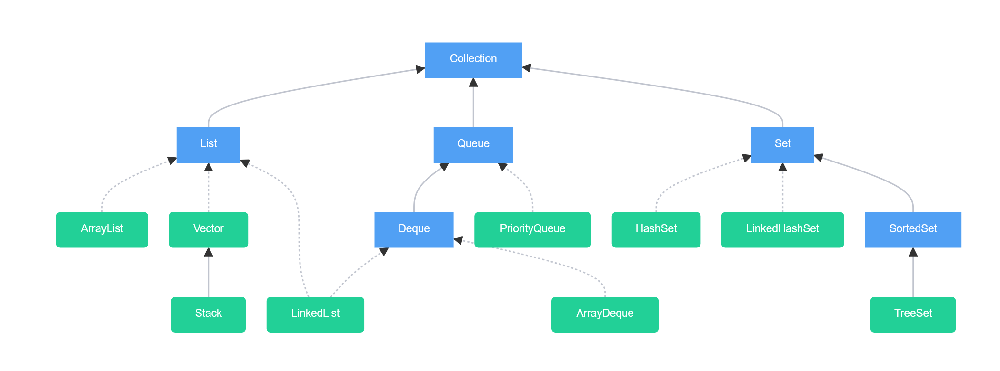

# Collections

Collections in Java are a framework that provides an architecture to store and manipulate a group of objects.

## Collection Methods

| Method                                    | Description                                                                      |
|-------------------------------------------|----------------------------------------------------------------------------------|
| `add(E e)`                                | Adds the specified element to the collection.                                    |
| `addAll(Collection<? extends E> c)`       | Adds all elements from another collection to this collection.                   |
| `remove(Object o)`                        | Removes the first occurrence of the specified element from the collection.       |
| `contains(Object o)`                      | Returns `true` if the collection contains the specified element.                 |
| `size()`                                  | Returns the number of elements in the collection.                                |
| `isEmpty()`                               | Returns `true` if the collection is empty.                                       |
| `clear()`                                 | Removes all elements from the collection.                                        |
| `iterator()`                              | Returns an iterator for iterating over the collection.                           |
| `toArray()`                               | Returns an array containing all elements in the collection.                      |
| `forEach(Consumer<? super E> action)`     | Performs the given action for each element in the collection.                    |

### Iterable vs Iterator

| **Iterable** (java.lang.Iterable)        | **Iterator** (java.util.Iterator)                |
|------------------------------------------|--------------------------------------------------|
| Represents a collection that can be iterated. | Used to iterate over elements in a collection.    |
| Methods: `Iterator<T> iterator()`         | Methods: `boolean hasNext()`, `T next()`, `void remove()` |
| Supports for-each loops.                | Manual iteration: `while (X.hasNext())`.           |
| Example: ArrayList, HashSet             | Created from Iterable using `.iterator()`.        |

---

# Lists

The `List` interface is an ordered collection that stores and accesses elements sequentially. 

## List Methods

| Method                                | Description                                                                                                       |
|---------------------------------------|-------------------------------------------------------------------------------------------------------------------|
| `get(int index)`                      | Returns the element at the specified position in the list.                                                        |
| `set(int index, E element)`           | Replaces the element at the specified position in the list with the specified element.                            |
| `add(int index, E element)`           | Inserts the specified element at the specified position in the list.                                              |
| `remove(int index)`                   | Removes the element at the specified position in the list.                                                        |
| `indexOf(Object o)`                   | Returns the index of the first occurrence of the specified element in the list.                                   |
| `lastIndexOf(Object o)`               | Returns the index of the last occurrence of the specified element in the list.                                    |
| `subList(int fromIndex, int toIndex)` | Returns a view of the portion of the list between the specified `fromIndex`, inclusive, and `toIndex`, exclusive. |
| `listIterator()`                      | Returns a list iterator over the elements in the list (in proper sequence).                                       |
| `listIterator(int index)`             | Returns a list iterator starting from the specified index in the list.                                            |
| `containsAll(Collection<?> c)`        | Returns `true` if the list contains all the elements in the specified collection.                                 |

## Types of Lists

| Feature        | `ArrayList`                    | `LinkedList`                    | `Vector`                       | `Stack`                        |
|----------------|---------------------------------|---------------------------------|--------------------------------|--------------------------------|
| **Data Structure** | Dynamic Array                  | Doubly Linked List              | Dynamic Array                  | Extends `Vector`, uses Array   |
| **Access**      | O(1) for get                    | O(n) for get                    | O(1) for get                   | O(1) for get                   |
| **Insert/Delete** | O(n) for random insert/delete  | O(1) for insert/delete at ends  | O(n) for random insert/delete  | O(n) for random insert/delete  |
| **Thread-Safety** | Not synchronized               | Not synchronized                | Synchronized                   | Synchronized                   |
| **Use Case**      | Best for frequent access      | Best for frequent insert/delete at ends | Best when thread-safety needed | Extends `Vector`, used as LIFO (Last In First Out) |

### Methods to Traverse Lists

| Traversal Method              | Example Code                                                                 |
|-------------------------------|-------------------------------------------------------------------------------|
| `forEach`                      | `list.forEach(System.out::println);`                                          |
| Loop with Index                | `for (int i = 0; i < list.size(); i++) { System.out.println(list.get(i)); }` |
| `Iterator`                     | `Iterator<String> iterator = list.iterator(); while (iterator.hasNext()) { System.out.println(iterator.next()); }` |
| `ListIterator` (works in both directions) | `ListIterator<String> listIterator = list.listIterator(); while (listIterator.hasNext()) { System.out.println(listIterator.next()); }` |
| `forEach + Lambda`             | `list.forEach(element -> System.out.println(element));`                        |
| `Stream`                       | `list.stream().forEach(System.out::println);`                                  |

---

## Set Interface

`Set` interface represents a collection fo unique elements. It generally is unordered and is fast for searching elements.

### Common Methods in Set

| Method                              | Description                                                                                                      |
|-------------------------------------|------------------------------------------------------------------------------------------------------------------|
| `add(E e)`                          | Adds the specified element to the set if it is not already present.                                              |
| `remove(Object o)`                  | Removes the specified element from the set.                                                                       |
| `contains(Object o)`                | Returns `true` if the set contains the specified element.                                                        |
| `size()`                            | Returns the number of elements in the set.                                                                        |
| `isEmpty()`                         | Returns `true` if the set is empty.                                                                               |
| `clear()`                           | Removes all elements from the set.                                                                                |
| `iterator()`                        | Returns an iterator over the elements in the set.                                                                |
| `addAll(Collection<? extends E> c)` | Adds all elements from the specified collection to the set.                                                      |
| `retainAll(Collection<?> c)`        | Retains only the elements in the set that are also contained in the specified collection.                        |

### Implementations of Set

- **HashSet**:
  - Implements the `Set` interface.
  - Does not guarantee any order of elements.
  - Provides constant-time performance for basic operations like add, remove, and contains (on average).

- **LinkedHashSet**:
  - Extends `HashSet` and implements the `Set` interface.
  - Maintains the insertion order of elements
  - Slightly slower than `HashSet` due to the extra overhead of maintaining the insertion order.

- **SortedSet** (interface):
    - Extends the `Set` interface 
    - Stores in natural order of the elements (if they implement Comparable) or a custom order defined by a Comparator

- **TreeSet**:
  - Implements the `SortedSet` interface.
  - Stores elements in a sorted order according to their natural ordering or a custom comparator.
  - Provides logarithmic time cost for the basic operations (`add`, `remove`, `contains`).

---

## Queue and Deque Interfaces

The `Queue` interface represents a collection designed for holding elements prior to processing. The `Deque` (double-ended queue) extends `Queue` and allows elements to be added or removed from both ends of the queue. 

---

## Common Methods

Here’s a list of some common methods that apply across multiple collection types:

| Method                                  | Description                                                                                                      |
|-----------------------------------------|------------------------------------------------------------------------------------------------------------------|
| `add(E e)`                              | Adds the specified element to the collection (works for `List`, `Set`, `Queue`).                                |
| `remove(Object o)`                      | Removes the first occurrence of the specified element from the collection.                                       |
| `contains(Object o)`                    | Returns `true` if the collection contains the specified element.                                                 |
| `size()`                                | Returns the number of elements in the collection.                                                                |
| `isEmpty()`                             | Returns `true` if the collection is empty.                                                                       |
| `clear()`                               | Removes all elements from the collection.                                                                        |
| `forEach(Consumer<? super E> action)`   | Performs the given action for each element in the collection.                                                    |

---

For more details: [Java Collections Framework](https://docs.oracle.com/javase/8/docs/technotes/guides/collections/).