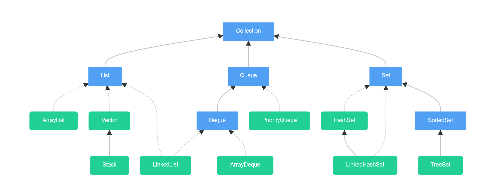

# Collections
Collections in Java are a framework that provides an architecture to store and manipulate a group of objects.

## Collection Methods
| Method                          | Description                                                                        |
|---------------------------------|------------------------------------------------------------------------------------|
| `add(E e)`                      | Adds the specified element to the collection.                                      |
| `addAll(Collection<? extends E> c)` | Adds all elements from another collection to this collection.                     |
| `remove(Object o)`              | Removes the first occurrence of the specified element from the collection.         |
| `contains(Object o)`            | Returns `true` if the collection contains the specified element.                   |
| `size()`                        | Returns the number of elements in the collection.                                  |
| `isEmpty()`                     | Returns `true` if the collection is empty.                                         |
| `clear()`                       | Removes all elements from the collection.                                          |
| `iterator()`                    | Returns an iterator for iterating over the collection.                             |
| `toArray()`                     | Returns an array containing all elements in the collection.                        |
| `forEach(Consumer<? super E> action)` | Performs the given action for each element in the collection.                     |

#### Iterable vs Iterator

| Iterable (java.lang.iterable) | Iterator (java.util.Iterator) |
|--|--|
| Represents a collection that can be iterated  | Used to iterator over elements in a collection |
| Methods: `Iterator<T> iterator()` | Methods: `boolean hasNext()`, `T next()`, and `void remove()`  |
| For-each loops          | Manual iteration `while (X.hasNext())` |
| eg. ArrayList, HashSet | created from iterable using .iterator()

# Lists
List interface is an ordered collection that stores and accesses elements sequentially. 

## List Methods
| Method                                | Description                                                                                                       |
| ------------------------------------- | ----------------------------------------------------------------------------------------------------------------- |
| `get(int index)`                      | Returns the element at the specified position in the list.                                                        |
| `set(int index, E element)`           | Replaces the element at the specified position in the list with the specified element.                            |
| `add(int index, E element)`           | Inserts the specified element at the specified position in the list.                                              |
| `remove(int index)`                   | Removes the element at the specified position in the list.                                                        |
| `indexOf(Object o)`                   | Returns the index of the first occurrence of the specified element in the list.                                   |
| `lastIndexOf(Object o)`               | Returns the index of the last occurrence of the specified element in the list.                                    |
| `subList(int fromIndex, int toIndex)` | Returns a view of the portion of the list between the specified `fromIndex`, inclusive, and `toIndex`, exclusive. |
| `listIterator()`                      | Returns a list iterator over the elements in the list (in proper sequence).                                       |
| `listIterator(int index)`             | Returns a list iterator starting from the specified index in the list.                                            |
| `containsAll(Collection<?> c)`        | Returns `true` if the list contains all the elements in the specified collection.                                 |

## Types of Lists

| Feature        | `ArrayList`                    | `LinkedList`                    | `Vector`                       | `Stack`                        |
|------------------------------|--------------------------------|---------------------------------|--------------------------------|--------------------------------|
| **Data Structure** | Dynamic Array                  | Doubly Linked List              | Dynamic Array                  | Extends `Vector`, uses Array   |
| **Access**      | O(1) for get      | O(n) for get       | O(1) for get      | O(1) for get      |
| **Insert/Delete** | O(n) for random insert/delete  | O(1) for insert/delete at ends  | O(n) for random insert/delete  | O(n) for random insert/delete  |
| **Thread-Safety**             | Not synchronized               | Not synchronized                | Synchronized                   | Synchronized                   |
| **Use Case**                  | Best for frequent access      | Best for frequent insert/delete at ends | Best when thread-safety needed | Extends `Vector`, used as LIFO (Last In First Out) |
