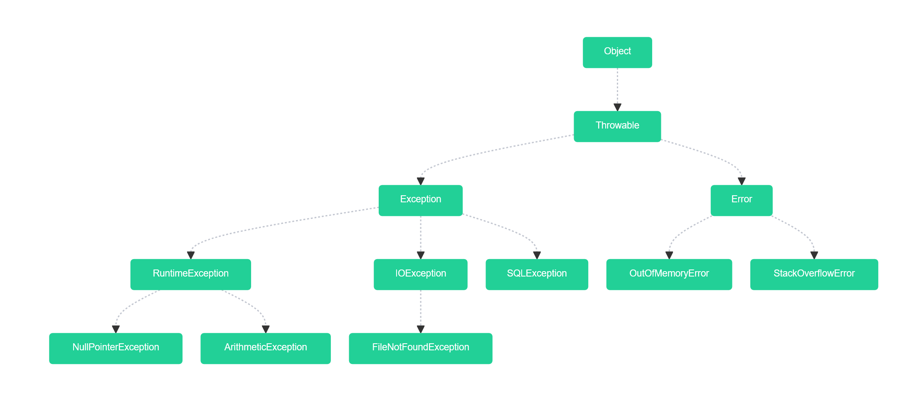

# Exception Handling in Java

Exception handling in Java is a powerful mechanism that allows developers to manage runtime errors and maintain normal application flow.



---

## What is an Exception?

An **exception** is an event that disrupts the normal flow of the program during execution. It is an object which is thrown at runtime.

| **Method**                                | **Description**                                                               |
| ----------------------------------------------- | ----------------------------------------------------------------------------- |
| `getMessage()`                                  | Returns a detailed message about the exception.                               |
| `getLocalizedMessage()`                         | Returns a localized description of the exception (can be overridden).         |
| `getCause()`                                    | Returns the cause of the exception (another `Throwable` object).              |
| `initCause(Throwable cause)`                    | Initializes the cause of the exception (usually set in the constructor).      |
| `printStackTrace()`                             | Prints the stack trace of the exception to the standard error stream.         |
| `setStackTrace(StackTraceElement[] stackTrace)` | Sets the stack trace of the exception.                                        |
| `fillInStackTrace()`                            | Fills in the stack trace of the `Throwable` object (invoked automatically).   |
| `toString()`                                    | Returns a short description of the `Throwable` object (including class name). |
| `getStackTrace()`                               | Returns an array of `StackTraceElement` objects representing the stack trace. |

---

## Types of Exceptions

| Type               | Description                                                                 |
|--------------------|-----------------------------------------------------------------------------|
| **Checked**        | Exceptions that are checked at compile-time. Must be handled or declared.  |
| **Unchecked**      | Runtime exceptions that are not checked at compile-time.                   |
| **Errors**         | Serious issues (like `OutOfMemoryError`) that are usually unrecoverable.   |

---

## Common Checked Exceptions
Checked exceptions are exceptions that the compiler checks at compile-time. These must be either caught using a try-catch block or declared in the method using throws. Used for recoverable conditions, like missing files or network issues

| Exception              | Description                                     |
|------------------------|-------------------------------------------------|
| `IOException`          | I/O operation failure.                          |
| `SQLException`         | Database access error.                         |
| `FileNotFoundException`| File does not exist.                           |
| `ParseException`       | Error during parsing.                          |

---

## Common Unchecked Exceptions
Unchecked exceptions are not checked at compile-time. They are subclasses of RuntimeException and usually indicate programming errors. Used for programming bugs like accessing a null object or dividing by zero.
| Exception              | Description                                     |
|------------------------|-------------------------------------------------|
| `NullPointerException`| Accessing an object with `null` reference.     |
| `ArrayIndexOutOfBoundsException` | Array index is out of bounds.         |
| `ArithmeticException` | Division by zero.                              |
| `IllegalArgumentException` | Method called with illegal argument.      |

---

## Basic Syntax

```java
try {
    // Code that may throw an exception
} catch (ExceptionType e) {
    // Handling code
} finally {
    // Code that always executes (optional)
}
```
* * *

## Example: Basic Try-Catch

```java
public class ExceptionExample {
    public static void main(String[] args) {
        try {
            int result = 10 / 0; // Will throw ArithmeticException
        } catch (ArithmeticException e) {
            System.out.println("Cannot divide by zero.");
        }
    }
}
```

* * *

## Multiple Catch Blocks

```java
try {
    String str = null;
    str.length(); // Throws NullPointerException
} catch (ArithmeticException e) {
    System.out.println("Math error occurred.");
} catch (NullPointerException e) {
    System.out.println("Null reference encountered.");
}
```

✅ Order matters: Catch more specific exceptions before more general ones.

* * *

## Finally Block

The `finally` block is used to execute important code such as closing resources.

```java
try {
    FileReader reader = new FileReader("file.txt");
} catch (FileNotFoundException e) {
    System.out.println("File not found.");
} finally {
    System.out.println("This block always executes.");
}
```

* * *

## Throwing Exceptions

Use `throw` to explicitly throw an exception.

```java
public void validateAge(int age) {
    if (age < 18) {
        throw new IllegalArgumentException("Age must be 18 or older.");
    }
}
```

* * *

## Throws Keyword

Use `throws` to declare exceptions a method might throw.

```java
public void readFile(String path) throws IOException {
    FileReader reader = new FileReader(path);
}
```

* * *

## Custom Exceptions

You can define your own exceptions by extending `Exception` or `RuntimeException`.

```java
class InvalidUserException extends Exception {
    public InvalidUserException(String message) {
        super(message);
    }
}
```

* * *

## Best Practices

-   Catch only specific exceptions you can handle.
    
-   Avoid empty catch blocks.
    
-   Always clean up resources (use try-with-resources).
    
-   Don’t use exceptions for control flow.
    
-   Create meaningful custom exceptions.
    

* * *

## Try-With-Resources (Java 7+)

Automatically closes resources like files or DB connections.

```java
try (BufferedReader reader = new BufferedReader(new FileReader("data.txt"))) {
    String line = reader.readLine();
} catch (IOException e) {
    e.printStackTrace();
}
```

* * *

## Exception Chaining

Used to associate one exception with another.

```java
try {
    throw new IOException("Disk error");
} catch (IOException e) {
    throw new RuntimeException("Failed to process file", e);
}
```

* * *

| Keyword   | Purpose                                             |
| --------- | --------------------------------------------------- |
| `try`     | Defines a block of code to test for errors.         |
| `catch`   | Catches and handles exceptions.                     |
| `finally` | Executes after try-catch, regardless of exceptions. |
| `throw`   | Throws an exception explicitly.                     |
| `throws`  | Declares exceptions that a method may throw.        |


* * *

For more details: [Java Exceptions - Oracle Docs](https://docs.oracle.com/javase/tutorial/essential/exceptions/)