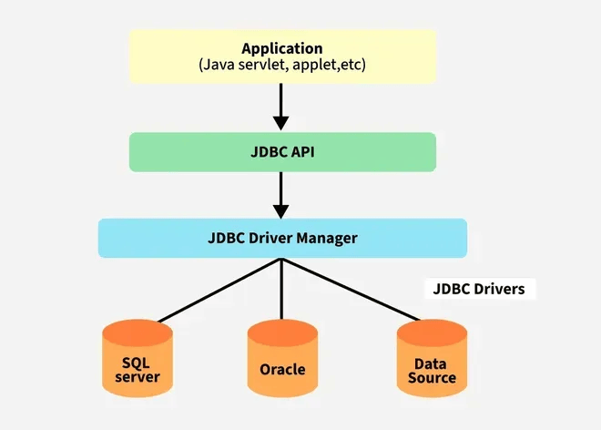

# JDBC (Java Database Connectivity)

JDBC is an API in Java that enables interaction between Java applications and relational databases. It provides methods to query and update data in a database using SQL.



---

## JDBC Architecture

JDBC consists of two main layers:
- **JDBC API**: Interface for Java applications to access databases.
- **JDBC Driver**: Implementation that connects the application to the database.

---

## JDBC Driver Types

JDBC drivers are divided into four types based on their architecture:

| Driver Type | Name                 | Description                                                                                      | Advantages                                                | Disadvantages                                                 |
|-------------|----------------------|--------------------------------------------------------------------------------------------------|-----------------------------------------------------------|----------------------------------------------------------------|
| **Type 1**  | JDBC-ODBC Bridge     | Translates JDBC calls into ODBC calls; requires ODBC drivers.                                    | Easy to use for legacy databases.                         | Deprecated, slow, platform-dependent, requires native drivers. |
| **Type 2**  | Native-API Driver    | Converts JDBC calls into native API calls of the database (uses native libraries).               | Faster than Type 1.                                       | Platform-dependent, needs native DB libraries.                |
| **Type 3**  | Network Protocol     | Sends JDBC calls to a middleware server, which then communicates with the database.              | Database-independent; no native library needed.           | Slower due to extra network layer.                            |
| **Type 4**  | Thin Driver (Pure Java) | Converts JDBC calls directly into database protocol; implemented in Java.                          | Platform-independent, best performance, widely used.      | Database-specific (one driver per DB type).                   |

> 💡 **Type 4 drivers** are the most commonly used in modern Java applications (e.g., MySQL Connector/J, PostgreSQL JDBC Driver).

---

## Key JDBC Interfaces and Classes

| Interface/Class       | Description                                                                 |
|-----------------------|-----------------------------------------------------------------------------|
| `DriverManager`       | Manages JDBC drivers and establishes DB connections.                        |
| `Connection`          | Represents a session with the database.                                     |
| `Statement`           | Executes SQL queries directly.                                              |
| `PreparedStatement`   | Executes precompiled SQL queries with parameters.                           |
| `CallableStatement`   | Executes stored procedures.                                                 |
| `ResultSet`           | Stores the result of executed queries.                                     |
| `SQLException`        | Handles database access errors.                                             |

---

## JDBC Workflow

1. **Load driver**  
   `Class.forName("com.mysql.cj.jdbc.Driver");`

2. **Establish connection**  
   `Connection conn = DriverManager.getConnection(DB_URL, USER, PASS);`

3. **Create statement**  
   `Statement stmt = conn.createStatement();`

4. **Execute query**  
   `ResultSet rs = stmt.executeQuery("SELECT * FROM users");`

5. **Process result**  
   ```java
   while (rs.next()) {
       int id = rs.getInt("id");
       String name = rs.getString("name");
   }```

6. **Close resources**

   ```java
   rs.close();
   stmt.close();
   conn.close();
   ```

---

## Statement Types Comparison

| Feature            | `Statement`             | `PreparedStatement`                  | `CallableStatement`             |
| ------------------ | ----------------------- | ------------------------------------ | ------------------------------- |
| SQL Injection Safe | ❌ No                    | ✅ Yes                                | ✅ Yes                           |
| Performance        | Lower                   | Higher (precompiled)                 | High (optimized for procedures) |
| Use Case           | Static SQL              | Dynamic SQL with parameters          | Stored procedures               |
| Example            | `"SELECT * FROM users"` | `"SELECT * FROM users WHERE id = ?"` | `"{call getUser(?)}"`           |

---

## Common JDBC Methods

| Method                         | Description                                                 |
| ------------------------------ | ----------------------------------------------------------- |
| `createStatement()`            | Creates a `Statement` object.                               |
| `prepareStatement(String sql)` | Creates a `PreparedStatement` for precompiled SQL queries.  |
| `executeQuery(String sql)`     | Executes SELECT queries. Returns a `ResultSet`.             |
| `executeUpdate(String sql)`    | Executes INSERT/UPDATE/DELETE. Returns update count.        |
| `setXxx(int, value)`           | Sets parameter value in `PreparedStatement`.                |
| `getXxx(columnName)`           | Retrieves value from `ResultSet`.                           |
| `close()`                      | Closes resources like connection, statement, or result set. |

---

## ResultSet Navigation

| Method       | Description                             |
| ------------ | --------------------------------------- |
| `next()`     | Moves cursor to the next row.           |
| `previous()` | Moves to previous row (if scrollable).  |
| `first()`    | Moves to the first row (if scrollable). |
| `last()`     | Moves to the last row (if scrollable).  |
| `getXxx()`   | Retrieves column data by name or index. |

---

## Best Practices

* Use **try-with-resources** to auto-close connections.
* Prefer **PreparedStatement** over **Statement** to avoid SQL injection.
* Use **connection pooling** (e.g., HikariCP, Apache DBCP) for better performance.
* Store credentials securely (not hard-coded).

---

## Example: Insert Using PreparedStatement
```java
String sql = "INSERT INTO employees (name, role) VALUES (?, ?)";
try (Connection conn = DriverManager.getConnection(DB_URL, USER, PASS);
     PreparedStatement pstmt = conn.prepareStatement(sql)) {
    pstmt.setString(1, "Alice");
    pstmt.setString(2, "Engineer");
    pstmt.executeUpdate();
}
```

## Additional Resources

* [JDBC Tutorial - Oracle Docs](https://docs.oracle.com/javase/tutorial/jdbc/)
* [JDBC API Reference](https://docs.oracle.com/javase/8/docs/api/java/sql/package-summary.html)
